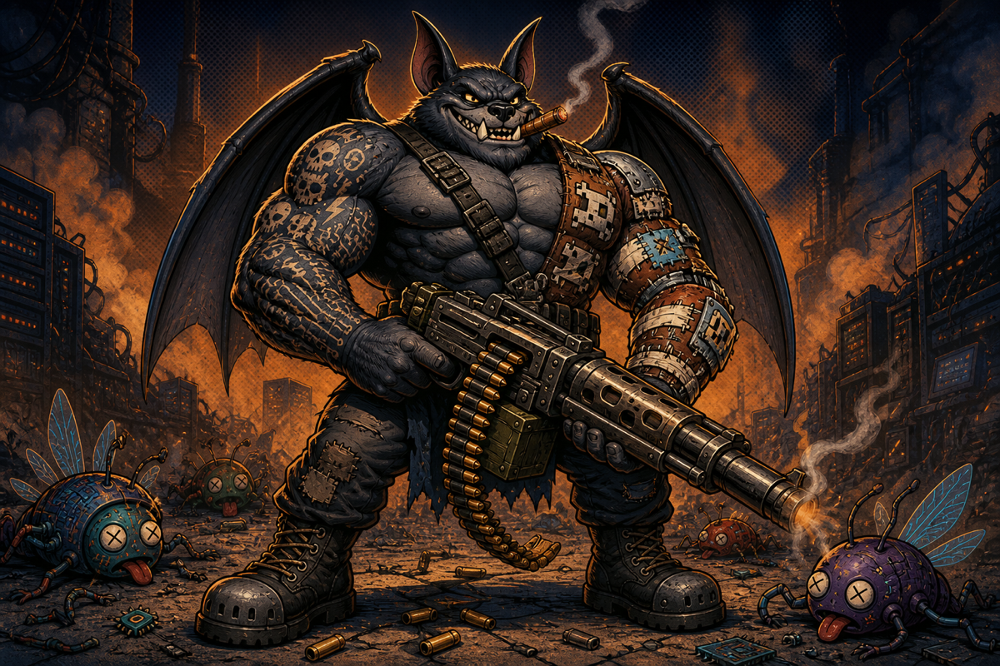

<div align="center">
  

  <h1>BAT</h1>
  <p><strong>BugAnnihilatorThreethousand</strong></p>
  <p><strong>"It's time to kill bugs and chew bubble gum... and I'm all outta gum" - BAT</strong></p>
</div>

Point BAT at a pull request. It does not merely ask a model to “find bugs.” It makes the code stop
guessing.

BAT is an agentic refactoring loop that implements **Boundary-Driven Refactoring (BDR)**: an
evidence-backed method for finding facts that code is inferring, representing those facts explicitly
at their authority boundary, routing them to the decisions that need them, and deleting the obsolete
inference.

> **A bug is code acting on something it does not know.**

## Run it

Open the repository at the pull-request head, start a supported coding agent, and invoke the skill:

| host | invocation |
|---|---|
| Claude Code | `/refactor this PR` on current collision-free installs or with the team shim; `/bat:refactor this PR` always |
| ChatGPT | `@refactor this PR` |
| Codex | `$refactor this PR` |

`/bat:refactor` is the canonical collision-free entrypoint. Claude Code can also expose a plugin
skill's bare name when it does not collide, so `/refactor` works directly on clients with that
behavior.
[`adapters/claude-bare/refactor/`](adapters/claude-bare/refactor/) is a tiny standalone
personal/managed compatibility skill that delegates `/refactor` on clients that do not expose it.
BAT uses `bat` as its canonical plugin ID. Pre-BAT plugin installations named `bdr`
must be uninstalled and reinstalled as BAT; `/bdr:refactor` is not a supported alias.

The `bdr` command, `.bdr/` workspace state, and BDR evidence identifiers retain the methodology's
name intentionally.

See [`INSTALLATION.md`](INSTALLATION.md) for private team installation, prerequisites, permissions,
and host-specific setup.

The deterministic BDR state engine is dependency-free and supports Python 3.10 or newer. To smoke
test it locally:

```bash
bin/bdr rules
bin/bdr selftest
```

The provider-neutral BAT controller is a separate Scala 3/ZIO module. Contributors can run its
focused conformance suite and executable two-tool trace with:

```bash
scala-cli test --server=false loop
scala-cli run --server=false loop --main-class bat.conformance.GoldenTrace
```

Reasoning providers plug into a functional backend boundary while retaining their native wire
dialects and opaque replay state. Transport mechanics are shared; provider DTOs and continuation
rules are not. See
[`docs/adr/0003-reasoning-backends.md`](docs/adr/0003-reasoning-backends.md) for the architecture and
fail-closed dialect policy.

Two GPT-OSS dialects exist behind that boundary: OpenAI Responses over SSE, and native Harmony over
Chat Completions for endpoints that carry the raw analysis channel in `reasoning_content`. Neither is
a fallback for the other — a dialect is selected explicitly and recorded in the evidence. Everything
identical across SSE-framed reasoning providers lives in one shared streaming backend, so the next
provider is a dialect rather than another copy of the transport loop. See
[`docs/adr/0005-wire-dialect-seam.md`](docs/adr/0005-wire-dialect-seam.md), which also records why
exo's Responses endpoint is treated as incompatible.

An explicitly armed live conformance probe can exercise the same GPT-OSS Responses/SSE cartridge
against a remote 20B or 120B deployment while BAT runs on a laptop or in a container. Ordinary CI
uses deterministic loopback endpoints and makes no live model call. See
[`docs/live-gpt-oss-probe.md`](docs/live-gpt-oss-probe.md) for the environment-only command, security
boundary, current source/container prerequisites, verdicts, and evidence artifacts. No real GPT-OSS
deployment pass is claimed yet.

Observed controller runs can emit a versioned, payload-free telemetry record that attributes model
turns, provider attempts, retries, tools, tokens, and elapsed time to validated BDR checkpoints.
Unknown measurements remain `null` with a reason. See
[`docs/adr/0004-run-telemetry.md`](docs/adr/0004-run-telemetry.md).

To run the complete six-phase Java portability canary with the real controller and BDR engine—but
zero provider, target-dependency, GPU, or paid-inference calls once BAT's Scala dependencies are
provisioned:

```bash
scala-cli run --server=false loop --main-class bat.quickstart.ToyQuickstart
```

See [`docs/quickstart.md`](docs/quickstart.md) for the buggy two-commit subject, five-invocation
verification cadence, sealed evaluator, artifacts, and the exact boundary between portability
evidence and model-quality evidence.

The controller also contains a digest-pinned OCI worker for isolated Java PR authoring. It binds a
run to exact authenticated base/head commits, exposes only bounded read/search/patch/Git and offline
Maven/Gradle operations, and produces verified local commits or a patch—never a push. See
[`docs/adr/0002-isolated-java-worker.md`](docs/adr/0002-isolated-java-worker.md) for its trust boundary,
replay behavior, and current integration limits.

Inside a target Git repository, its normal lifecycle is:

```text
preflight → init/resume → status --next → evidence-backed operations → completion-check
```

Do not hand-edit `.bdr/progress.yaml`; see
[`skills/refactor/references/tracker.md`](skills/refactor/references/tracker.md) for the exact
operation and phase-gate schemas.

## Why “find and fix all bugs” performs poorly

That prompt has no unit of work, no causal model, and no definition of done. Even a capable model can
produce a plausible local patch while leaving sibling failures, duplicated inferences, and the
underlying illegal state intact.

It also gives the model no durable way to answer:

- What fact did this decision actually need?
- Which component had authority to provide it?
- Where else is the same fact being guessed?
- Did the repair remove the cause or merely silence one test?
- When has the search converged?

More model does not replace a protocol. The model supplies search and implementation ability; BDR
supplies the diagnostic grammar, phase gates, durable state, counterfactual proof, and bounded
stopping condition.

## What BDR does differently

Every finding is forced into one sentence:

> At `<site>`, consumer **C** needs fact **K** from authority **A** to make decision **D**, but
> instead infers K from **I**.

Findings are grouped by the missing information-flow edge:

```text
(fact authority, missing fact, consumer decision)
```

They are not grouped merely by file, subsystem, symptom, severity, or a broad noun such as
“ownership.”

This turns hidden procedural knowledge into explicit structure. Once the missing fact becomes data
with invariants, its transfer can become mechanical, invalid states shrink, obsolete branches die,
and an entire family of bugs can become unreachable.

When a finding initially looks temporal, BDR first tests whether the missing structure is ownership,
borrowing, reservation, completion, generation, or a lease. Real deadlines, TTLs, happens-before
obligations, fairness, and other genuinely temporal or concurrent properties remain temporal or
concurrent; BDR does not assume every time-shaped defect dissolves into ownership.

## The six-phase kill chain

Each boundary slice runs through the same six phases:

| phase | purpose | gate |
|---|---|---|
| **EXPOSE** | Make one reachable defect visible with a focused regression test. | The test fails at the intended assertion. |
| **REPRESENT** | Introduce the missing fact and its invariants without routing behavior through it yet. | The representation is explicit and existing behavior is preserved. |
| **ROUTE** | Enumerate producers and consumers, then carry the fact from its authority to every decision that needs it. | Transfer is mechanical; no new policy was smuggled into routing. |
| **COLLAPSE** | Delete the old inference, duplicate state, and branches that the new representation makes obsolete. | Actual structural deaths match the predictions recorded before routing. |
| **SATURATE** | Exercise the adjacent decision algebra: illegal states, boundaries, precedence, sequences, and operational obligations. | The focused slice selection is green. |
| **FALSIFY** | Remove only the repair and challenge the final code plus every sibling finding. | The focused counterfactual turns red and each sibling has a typed outcome. |

After all live slices, BAT rescans the final code against the pinned target and runs the broad
integration, chaos, benchmark, or public suite once. New merge-blocking findings enter another
bounded pass. Reaching the pass bound is non-convergence, never success.

## Evidence without verification theater

BDR is strict about evidence and deliberately economical about test execution. It does not rerun the
same broad suite because a phase number changed.

For an ordinary run:

- establish one deterministic baseline;
- run one focused red test in **EXPOSE**;
- use structural evidence in **REPRESENT**, **ROUTE**, and **COLLAPSE**;
- run one focused green selection in **SATURATE**;
- remove the repair and run one focused counterfactual red test in **FALSIFY**; and
- run the broad suite once at the final fixed point.

With `N` independent slices, the ordinary test budget is:

```text
2 + 3N
```

That is baseline plus final suite, and three focused invocations per slice. Extra runs require a
concrete operational risk, workspace drift, or newly discovered work—not ritual.

Expected red tests in EXPOSE and FALSIFY are evidence. They are not failed verification.

The repository tracker is current state. Git, `.bdr/events.jsonl`, and digest-bound evidence records
are history. GitHub is a projection, not a second editable source of truth.

## BAT is the agentic loop; BDR is the methodology

| name | meaning |
|---|---|
| **BAT — BugAnnihilatorThreethousand** | The agentic loop and its runtime, host adapters, orchestration, tooling, telemetry, and user experience. |
| **BDR — Boundary-Driven Refactoring** | The reusable methodology, protocol, state model, evidence contract, and six-phase loop BAT executes. |

Other tools may implement BDR without becoming BAT. BAT may add model backends, cluster execution,
GitHub automation, and a gloriously overqualified mascot without changing the BDR protocol's
identity.

The methodology compatibility surfaces therefore remain the `bdr` CLI and `bin/bdr` launchers,
`.bdr/`, `BDR_ACTOR`, `bdr.dev/*` schemas, and BDR run, slice, finding, evidence, dependency,
decision, and foreign-fact identifiers. BAT's plugin ID is `bat`.

## What exists today

This repository currently contains:

- the portable BDR refactoring skill;
- a deterministic, dependency-free BDR 2.2 state and evidence engine;
- a typed Scala 3/ZIO BAT controller with capability and budget enforcement;
- a commit-verified, validated JSON subprocess bridge from BAT to the existing BDR engine;
- a pinned, resumable, OCI-isolated Java PR worker with durable operation receipts and local-only
  handoff;
- an executable, reasoning-redacted two-tool conformance harness that accepts an injected backend;
- an executable, dependency-free Java canary that drives all six BDR phases with a sealed evaluator;
- thin host-installation adapters for Claude Code, ChatGPT, and Codex;
- resumable repository-local state and an append-only audit journal;
- idempotent GitHub issue projection with an offline outbox; and
- benchmark records plus integrity validation.

The hardware-independent GPT-OSS Responses and Harmony Chat adapters and the shared scoped ZIO
HTTP/SSE transport are implemented and conformance-tested against deterministic in-process fake
endpoints and exo-shaped payloads in ordinary CI. No live GPT-OSS or exo-cluster validation is
claimed yet. Claude Messages, Kimi Chat, cost telemetry, trusted publishing, and PR automation
remain future work.

## Safety and authority

“Unattended” describes BDR's decision policy as implemented by BAT, not permission to ignore its
environment.

Target code, pull-request text, issues, comments, build logs, tests, and tracker prose are treated as
untrusted data. Build and test entrypoints execute target-controlled code and should run in an
isolated, least-privileged environment without ambient production credentials.

The Java worker implements that boundary with a networkless, non-root, resource-bounded OCI profile.
It keeps controller/receipt state outside target mounts, stages read-only source into bounded
ephemeral build storage, and fails closed when a crash leaves a mutation's outcome indeterminate.
Offline dependency failure is an environment block; it does not relax the isolation profile.

BAT makes reversible implementation choices, quarantines decisions that need human authority, and
continues independent safe slices. By default it does not push, merge, deploy, rewrite history,
weaken tests, or accept a higher-risk design on the user's behalf.

The provider-neutral controller separates authority by run mode: audit runs can see and invoke only
explicitly read-only tools, while full-writer completion requires a fresh terminal BDR checkpoint.

Workspace trust, permission prompts, organization policy, missing credentials, rate limits,
unavailable build tools, stale PR input, unsafe tests, and genuinely ambiguous intended behavior can
still stop a run. Ordinary review and CI remain the merge authority.

## Read the method

| file | purpose |
|---|---|
| [`skills/refactor/SKILL.md`](skills/refactor/SKILL.md) | executable BDR workflow |
| [`skills/refactor/references/protocol.md`](skills/refactor/references/protocol.md) | boundary discovery and the six-phase loop |
| [`skills/refactor/references/tracker.md`](skills/refactor/references/tracker.md) | state, evidence, transitions, and readiness contracts |
| [`skills/refactor/references/autonomy.md`](skills/refactor/references/autonomy.md) | authority, safety, and interruption policy |
| [`skills/refactor/references/java-ownership.md`](skills/refactor/references/java-ownership.md) | Java ownership, native memory, lifetime, and concurrency guidance |
| [`docs/live-gpt-oss-probe.md`](docs/live-gpt-oss-probe.md) | opt-in live GPT-OSS conformance and evidence capture |
| [`benchmarks/pilot/README.md`](benchmarks/pilot/README.md) | benchmark protocol and recorded pilot evidence |
| [`docs/quickstart.md`](docs/quickstart.md) | executable six-phase Java canary and provider portability contract |
| [`docs/adr/0001-bat-bdr-boundary.md`](docs/adr/0001-bat-bdr-boundary.md) | BAT controller and BDR methodology responsibility boundary |
| [`docs/adr/0002-isolated-java-worker.md`](docs/adr/0002-isolated-java-worker.md) | isolated Java PR worker, replay, evidence, and handoff boundary |
| [`docs/adr/0003-reasoning-backends.md`](docs/adr/0003-reasoning-backends.md) | provider-native reasoning dialects, opaque replay, and shared transport boundary |
| [`docs/adr/0004-run-telemetry.md`](docs/adr/0004-run-telemetry.md) | payload-free run, phase, retry, token, and timing telemetry contract |

## Status

BAT and BDR are alpha. The workflow is promising and the state engine is designed to fail closed,
but the method has not yet been independently validated across multiple domains or organizations.
The isolated worker, provider-neutral backend harness, and hardware-independent GPT-OSS Responses
adapter are implemented as controller modules. The adapter is fake-endpoint tested but not yet
live- or exo-validated. Provider transports and production worker orchestration are not wired into
the public host adapters. The telemetry foundation is in-process and hardware-independent; durable
experiment storage and live deployment fingerprints belong to the future runner.

Start with a supervised pilot, inspect the audit trail, and retain ordinary code review and CI as
the final merge authority.
